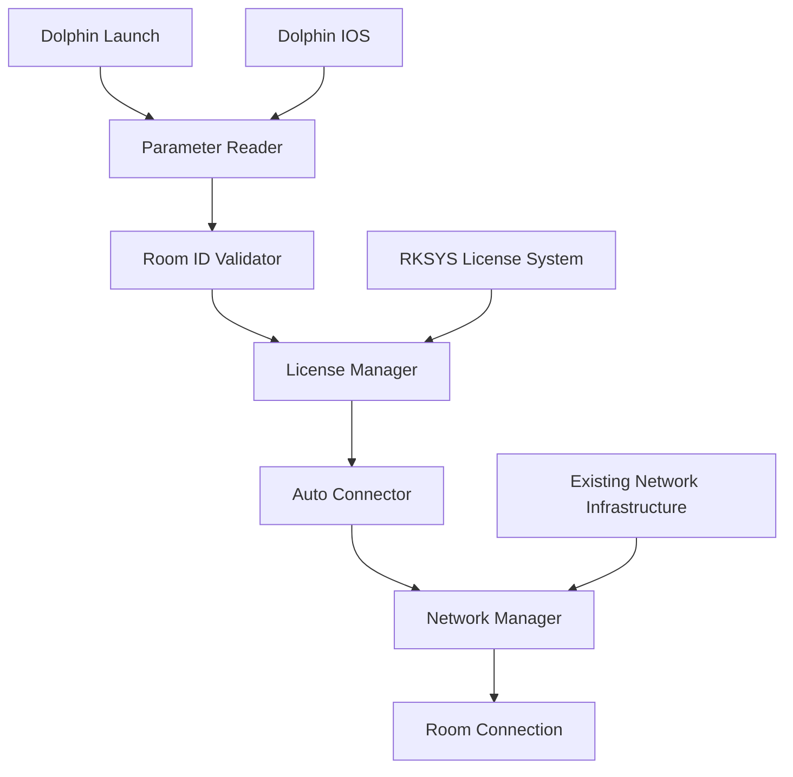

# Design Document

## Overview

The Dolphin Room Auto-Connect feature extends the existing PulsarEngine system to automatically connect players to specific rooms when launching Mario Kart Wii through Dolphin emulator. The system leverages the existing Dolphin IOS communication infrastructure to receive room parameters, automatically selects an appropriate license slot, and initiates room connection using the established network protocols.

The design integrates seamlessly with the current PulsarEngine architecture, utilizing existing components like the Dolphin IOS interface, network management system, and settings framework without requiring modifications to Mario Kart Wii headers or breaking compatibility with the old compiler.

This code does not support Unit tests, therefor you should NEVER WRITE ONE!!!!

## Architecture

### Component Overview



### Integration Points

1. **System Initialization Hook**: Integrates with `System::Init()` to initialize auto-connect functionality
2. **Dolphin IOS Extension**: Extends existing Dolphin communication to handle room parameters
3. **Network Manager Integration**: Uses existing `Network::Mgr` for room connection logic
4. **Settings Integration**: Leverages existing settings system for configuration storage

## Components and Interfaces

### 1. DolphinRoomConnector Class

**Location**: `PulsarEngine/Extra/DolphinRoomConnector.hpp/cpp`

**Purpose**: Main coordinator class that manages the auto-connection workflow

**Key Methods**:
- `Initialize()`: Sets up the auto-connector during system initialization
- `ProcessRoomParameter()`: Reads and validates room ID from Dolphin
- `AttemptAutoConnect()`: Orchestrates the connection process
- `IsEnabled()`: Checks if auto-connect should be active

**Integration**: Hooks into `System::Init()` and scene transitions

### 2. Dolphin IOS Parameter Extension

**Location**: `PulsarEngine/Dolphin/DolphinIOS.hpp/cpp`

**Purpose**: Extends existing Dolphin IOS communication to handle room parameters

**New IOCTL**: `IOCTL_DOLPHIN_GET_ROOM_PARAM = 0x0B`

**Key Methods**:
- `GetRoomParameter(char* roomId, u32 length)`: Retrieves room ID from Dolphin
- `HasRoomParameter()`: Checks if room parameter was provided

### 3. License Slot Manager

**Location**: `PulsarEngine/Extra/LicenseSlotManager.hpp/cpp`

**Purpose**: Handles automatic license slot selection and login

**Key Methods**:
- `SelectAvailableSlot()`: Finds and selects appropriate license slot
- `AutoLogin(u8 slotId)`: Automatically logs into specified slot
- `IsSlotAvailable(u8 slotId)`: Checks slot availability

**Integration**: Works with existing RKSYS license management system

### 4. Room Connection Handler

**Location**: `PulsarEngine/Extra/RoomConnectionHandler.hpp/cpp`

**Purpose**: Manages the actual room connection process

**Key Methods**:
- `ConnectToRoom(const char* roomId)`: Initiates room connection
- `ValidateRoomId(const char* roomId)`: Validates room ID format
- `HandleConnectionResult(bool success)`: Processes connection outcomes

**Integration**: Uses existing network infrastructure and room protocols

## Data Models

### RoomConnectionConfig Structure
```cpp
struct RoomConnectionConfig {
    char roomId[32];           // Room ID to connect to
    u8 targetLicenseSlot;      // License slot to use (0xFF = auto-select)
    bool isEnabled;            // Whether auto-connect is enabled
    u32 connectionTimeout;     // Timeout for connection attempts
    bool fallbackToMenu;       // Whether to fall back to menu on failure
};
```

### ConnectionState Enumeration
```cpp
enum ConnectionState {
    CONNECTION_IDLE,
    CONNECTION_READING_PARAMS,
    CONNECTION_SELECTING_LICENSE,
    CONNECTION_CONNECTING,
    CONNECTION_SUCCESS,
    CONNECTION_FAILED
};
```

## Error Handling

### Error Categories

1. **Parameter Errors**:
   - Invalid room ID format
   - Missing room parameter
   - Dolphin communication failure

2. **License Errors**:
   - No available license slots
   - License selection failure
   - Login timeout

3. **Connection Errors**:
   - Room not found
   - Room full
   - Network connection failure
   - Authentication failure

### Error Handling Strategy

- **Graceful Degradation**: All errors result in normal game startup
- **Logging**: Errors are logged for debugging purposes
- **User Feedback**: Connection status shown via existing UI systems
- **Fallback Behavior**: Always falls back to standard menu navigation

## Testing Strategy

### Unit Testing Approach

1. **Parameter Reading Tests**:
   - Valid room ID formats
   - Invalid room ID handling
   - Missing parameter scenarios
   - Dolphin communication edge cases

2. **License Management Tests**:
   - Slot selection logic
   - Auto-login functionality
   - Error handling for unavailable slots

3. **Connection Logic Tests**:
   - Room ID validation
   - Connection timeout handling
   - Success/failure scenarios

### Integration Testing

1. **Dolphin Integration**:
   - Parameter passing from Dolphin
   - IOS communication reliability
   - Emulator detection accuracy

2. **Network Integration**:
   - Room connection using existing protocols
   - Compatibility with current network stack
   - Error propagation through network layers

3. **System Integration**:
   - Initialization timing
   - Scene transition compatibility
   - Settings system integration

### Manual Testing Scenarios

1. **Happy Path Testing**:
   - Launch with valid room ID
   - Successful license selection
   - Successful room connection

2. **Error Path Testing**:
   - Invalid room IDs
   - Network failures
   - Full rooms
   - No available licenses

3. **Edge Case Testing**:
   - Console vs Dolphin behavior
   - Multiple launch attempts
   - Connection during different game states

## Implementation Considerations

### Compiler Compatibility

- Use C++98 compatible syntax
- Avoid modern C++ features
- Maintain compatibility with existing build system
- Use existing PulsarEngine patterns and conventions

### Performance Considerations

- Minimal impact on startup time
- Asynchronous connection attempts where possible
- Efficient parameter reading
- Memory-conscious implementation

### Security Considerations

- Input validation for room IDs
- Bounds checking for all parameters
- Safe string handling
- Protection against malformed input

### Maintainability

- Clear separation of concerns
- Consistent with existing codebase style
- Comprehensive error handling
- Detailed logging for debugging